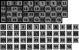
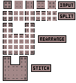
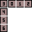
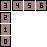

# CTM Guide
###### by Vortex [@vortex_so in discord, any suggestions are accepted]<br>

This file describes how to use CTM, structure of `.properties` file and some useful (or not) techniques

### Note:
- All textures for CTM textures are in `[modname]/mcpatcher/ctm` folder<br>
the overrides apply globally so it doesn't matter in which directory you put them<br>

- in the `ctm` folder you must have a folder with your block name (or any name actually)<br>
in that folder you will have all texture files (animations allowed via mcmeta file for every texture) and `.properties` file<br>
multiple `.properties` files are allowed for a single folder and set of textures for more complex behaviour (see examples)

## Quick Links
- **[Method](#method)**
- **[MatchBlocks](#matchblocks)**
- **[MatchTiles](#matchtiles)**
- **[Tiles](#tiles)**
- **[Connect](#connect)**
- **[Faces](#faces)**
- **[Biomes](#biomes)**
- **[Heights](#heights)**
- **[RenderPass](#renderpass)**
- **[InnerSeams](#innerseams)**
- **[Weights](#weights)**<br>
- **[Examples](#examples)**

## Structure of `.properties` files

---

## `matchBlocks`
Override for a specific block, you can get the value from the tooltip if you have this feature enabled.<br>
Can accept several values which allows to apply one CTM for different blocks.<br>
if no value for this property was provided, Angelica will fallback to name of the `.property` file

examples:<br>
`matchBlocks=gregtech:gt.blockcasings4`<br>
`matchBlocks=minecraft:glass minecraft:glass_pane`

---

## `matchTiles`
Override for a specific texture, main difference from matchBlocks is that this will only match a certain texture, not the block itself<br>

example:<br>
`matchTiles:minecraft:blocks/stone`

---

## `tiles`
The list of texture names for CTM. Supports ranges and explicit names.<br>
You probably would want to use texture names like `0.png`, `1.png` as it is easier, however this allows for any names

examples:<br>
`tiles=0-46` - classic for full CTM, expects files from `0.png` to `46.png`<br>
`tiles=0-3,5, 8` - expects files `0.png`, `1.png`, `2.png`, `3.png`, `5.png`, `8.png`<br>
`tiles=sometext,somemoretext` - expects files `sometext.png`, `somemoretext.png`

---

## `connect`
Sets how the blocks are connected, can accept values: `block`, `tile`, `material`<br>
`block` connects based on block (who would guess)<br>
`tile` connects based on texture<br>
`material` connects based on material (didn't really understand this part, ig it is for stone, iron, wood etc)<br>
Fallbacks to `block` if no value for `matchTiles` is set, otherwise fallbacks to `tile`<br>
Most of the time you don't need to set this value because of that fallback rule

example:<br>
`connect=block`

---

## `faces`
Limit to specific faces of a block, can accept several values<br>
Fallbacks to `all` if value not present in the `.properties` file

examples:<br>
`faces=top`<br>
`faces=all`<br>
`faces=bottom`<br>
`faces=sides`<br>
`faces=north south east west`<br>
`faces=top bottom sides`

---

## `biomes`
Limit to specific biomes, can accept several values<br>
Fallbacks to all if value not present in the `.properties` file

examples:<br>
`biomes=plains`<br>
`biomes=desert forest`<br>
`biomes=taiga jungle savanna`

---

## `heights`
Limit to certain Y levels, can only accept several values<br>
can be set through either `minHeight` and `maxHeight` or `heights`

examples:<br>
`heights=0-64`<br>
`heights=64-255`<br>
example of maxHeight and minHeight:<br>
`minHeight=64`<br>
`maxHeight=128`

---

## `renderPass`
Controls which rendering layer a CTM rule is applied in<br>
In most cases you only need it to avoid rendering issues with transparency

`renderPass=solid` used for fully opaque blocks<br>
`renderPass=cutout` used for fences, glass CTM, textured blocks with hard transparency<br>
`renderPass=translucent` used for transparent blocks like glass or water<br>
`renderPass=cutout_mipped` no idea for what<br>
`renderPass=overlay` used for blocks with an overlay, for example GT hatches or damaged anvils<br>
`renderPass=backface` used for blocks with a backface, however it is very rare to use this one

---

## `innerSeams`
Adds internal seams, fallback to `innerSeams=false` if not set<br>

example:<br>
`innerSeams=true`

---

## `weights`
Priority, used for `Random` type to determine which textures have certain chances to be used for render<br>
accepts several values, assigns values correspondingly to `tiles` list values

examples:<br>
`weight=10`<br>
`weights=1 3 3 2 1`

---

# `Method`

Selects CTM mode:
- [LINK](#full-ctm-ctm) `ctm` / `glass` / `default`
- [LINK](#compact-ctm) `compact` / `ctm_compact`
- [LINK](#horizontal)`horizontal` / `bookshelf`
- [LINK](#vertical)`vertical`
- [LINK](#horizontalvertical-hv)`horizontal+vertical` / `h+v`
- [LINK](#verticalhorizontal-vh)`vertical+horizontal` / `v+h`
- [LINK](#top)`top` / `sandstone`
- [LINK](#repeat)`repeat` / `pattern`
- [LINK](#random)`random`
- [LINK](#fixed)`fixed` / `static`

example:<br>
`method=ctm`

### Full CTM (ctm)

Requires exactly 47 tiles, the most versatile but the most size-heavy method

Here's a visual explanation of how the textures should be numbered:



---

### Compact CTM

Requires exactly 5 tiles.


Splits face into 4 quadrants and builds final texture per quadrant.

Here's a visual explanation of how it works on an example of 3x3 blocks pattern with a cutout:



as you can see, compact CTM has a single limitation:<br>
the size of any part of texture, such as an edge or a corner, can't be larger than `8x8` pixel<br>
this is the main case where only full CTM can be used.

---

### Horizontal

Requires exactly 4 tiles. connects only horizontally, used for bookshelves for example


---

### Vertical

Requires exactly 4 tiles.


---

### Horizontal+Vertical (h+v)

Requires exactly 7 tiles.

Two-stage: horizontal first, then vertical if none horizontal variations are found.



---

### Vertical+Horizontal (v+h)

Requires exactly 7 tiles.

Two-stage: vertical first, then horizontal if none vertical variations are found.



---

### Top

Requires exactly 1 tile.

Applies tile on side faces when block above matches, for example used for smooth sandstone

---

### Repeat

Requires width * height tiles.

Properties:
- `width` - defines the number of tiles in width
- `height` - defines the number of tiles in height
- `symmetry` - defines the symmetry of the pattern, can be either `none` or `opposite`

Just uses N*M grid, for example<br>
`0 1 2 3 4`<br>
`5 6 7 8 9`

---

### Random

Any number of tiles.

Properties:
- `weights` - described [here](#weights)
- `symmetry` - accepts `all`, `opposite`, `none`, groups opposite faces together, otherwise keeps them independent
- `linked` - makes the textures consistent between render states, not needed much

---

### Fixed

Requires exactly 1 tile. Always uses the same tile.<br>
useful only if combined with height or other properties (see examples)

---

# Examples

## Glass via full CTM
```properties
matchBlocks=minecraft:glass minecraft:glass_pane
metadata=0
method=ctm
faces=all
tiles=0-46
connect=block
```

## Multiple properties files usage
### Use multiple .properties files with different heights for more detailed worldgen
this one will use one texture for lower part of the world and another for the rest of the world
```properties
matchBlocks=minecraft:dirt
metadata=0
method=fixed
faces=all
tiles=0
connect=block
maxHeight=40
```

```properties
matchBlocks=minecraft:dirt
metadata=0
method=fixed
faces=all
tiles=0
connect=block
minHeight=41
```

---
